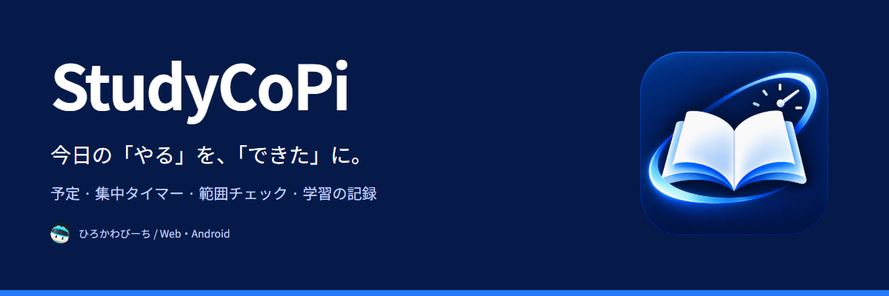
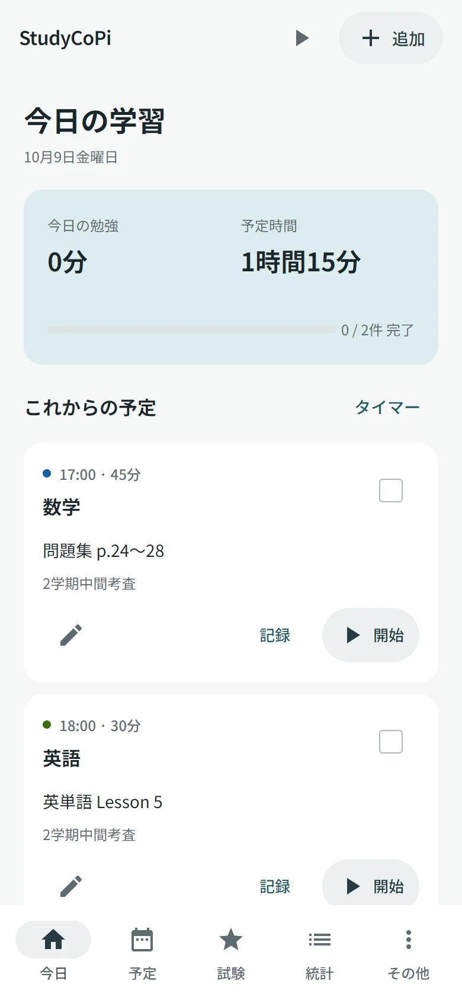
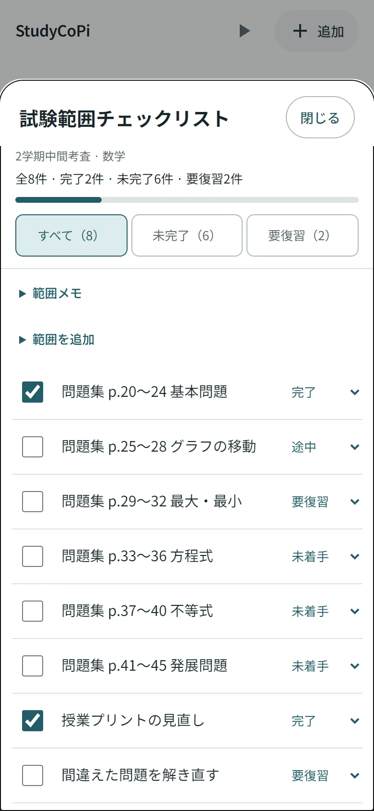
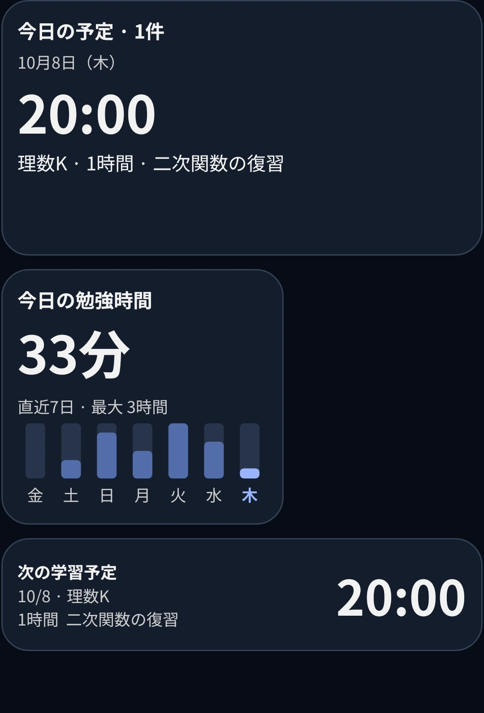
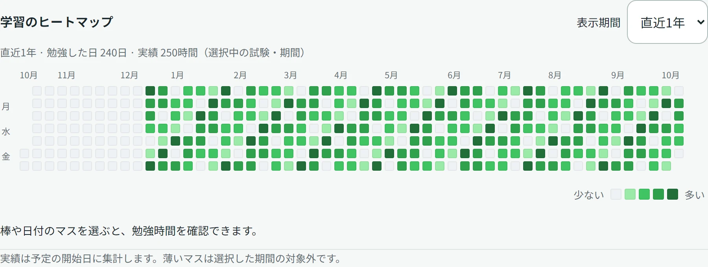

<p align="center">
  <a href="https://hirokawa-beach.github.io/StudyCoPi/"><strong>Web版を開く</strong></a> ·
  <a href="https://github.com/hirokawa-beach/StudyCoPi/releases/download/android-v1.5.1/StudyCoPi-Android-1.5.1.apk"><strong>Android APK</strong></a> ·
  <a href="https://hirokawa-beach.github.io/studycopi-guide/">紹介・使い方</a> ·
  <a href="https://github.com/hirokawa-beach/StudyCoPi/releases/tag/android-v1.5.1">v1.5.1 Release</a>
</p>

StudyCoPi（スタディコパイ）は、予定を立てるところから、集中して勉強し、振り返るところまでを支える学習管理アプリです。考査や模試を別々に管理し、今日やることと試験範囲の残りを見渡せます。Web版と、Kotlin・Jetpack Composeで作ったAndroid版があります。

## 勉強の流れを、ひとつに

| やりたいこと | StudyCoPiでできること |
| :--- | :--- |
| **予定を立てる** | 教科・日時・予定時間を登録。一覧と週間タイムテーブルを切り替えて確認。 |
| **範囲を進める** | 試験・教科ごとのチェックリスト。未着手・途中・要復習・完了を管理し、残りだけに絞る。 |
| **集中する** | 予定から、またはタイマー単独で開始。一時停止・再開・終了して記録。 |
| **振り返る** | 日・週・月の棒グラフと、GitHubのような年間ヒートマップ。期間・試験・教科で絞り込み。 |
| **ホーム画面で確認する** | Androidの6種類のウィジェット。円グラフ、7日間の棒グラフ、次の予定や目覚まし。 |

## 画面で見る

<table>
  <tr><th>今日の予定</th><th>試験範囲のチェック</th><th>Androidウィジェット</th></tr>
  <tr>
    <td width="33%"></td>
    <td width="33%"></td>
    <td width="33%"></td>
  </tr>
</table>



画面はサンプルデータを使った実際のアプリです。詳しい操作は[紹介サイト](https://hirokawa-beach.github.io/studycopi-guide/)と、アプリ内の「その他 → 使い方」で確認できます。

## はじめる

**Web：** [Web版](https://hirokawa-beach.github.io/StudyCoPi/)を開き、「追加」から今日の予定をひとつ作ります。予定を作らず「集中タイマー」から始めることもできます。

**Android：** [v1.5.1のAPK](https://github.com/hirokawa-beach/StudyCoPi/releases/download/android-v1.5.1/StudyCoPi-Android-1.5.1.apk)を端末で開いてインストールします。Android 8.0以降に対応。インストール元のブラウザなどに「不明なアプリのインストール」の許可が必要な場合があります。配布APKは開発用署名です。[Release](https://github.com/hirokawa-beach/StudyCoPi/releases/tag/android-v1.5.1)に変更内容とSHA-256チェックサムを掲載しています。

更新は上書きインストールしてください。先にアプリをアンインストールすると、端末内の学習データが削除されます。

## WebとAndroid

| 機能 | Web | Android |
| :--- | :---: | :---: |
| 予定・時間割・考査／模試・範囲チェック | ✓ | ✓ |
| 集中タイマー・実績・統計・ヒートマップ | ✓ | ✓ |
| JSONバックアップの保存・復元 | ✓ | ✓ |
| OSの画面固定・ホーム画面ウィジェット | 非対応 | ✓ |
| 二段階目覚まし・NFCによる解除 | 非対応 | ✓ |

Androidの目覚ましは数学・英語・世界史の問題に対応し、追加の問題や登録したNFCタグで解除できます。通知・アラーム・画面固定の利用は、端末の設定と許可に従います。

学習データは各端末内に保存します。**アカウント連携や端末間の自動同期はありません。** 移行には「その他 → バックアップ」からJSONを書き出して復元してください。範囲チェックを含むバックアップはv4形式のため、Web・Androidとも1.5.1以降で復元します。旧形式のバックアップも読み込めます。

## v1.5.1で変わったこと

- 新しい本と時計のアイコンに統一し、紹介サイトとバナーも更新。
- 範囲チェックを追加。全体の進捗を固定し、項目だけをスクロールして確認。
- Androidウィジェットのサイズ追従を改善し、グラフを端末の画面密度に合わせて描画。
- 予定なしで開始したタイマーは、終了時に必ず「完了」として記録。

過去の更新は[変更履歴](CHANGELOG.md)にまとめています。

## 開発する

Web版はビルド不要のHTML・CSS・JavaScriptです。リポジトリのルートをローカルHTTPサーバーで配信して開いてください。Androidの構成・ビルド・検証手順は[Android版README](android/README.md)にあります。

```sh
# Webのデータモデルと統計のテスト（Node.js）
node --test tests/study-model.test.cjs tests/checklist-model.test.cjs tests/statistics.test.cjs

# Androidのテスト・検査・配布APK作成（Windows）
android\gradlew.bat -p android :app:testDebugUnitTest :app:lintDebug :app:assembleLocal
```

共有の説明文は `shared/study-guide.json`、オリジナル音源は `shared/sounds/` が原本です。新アイコンのサイズ別書き出しには `scripts/export-brand-assets.py`（Pillow）を使います。

## フィードバックとライセンス

不具合や要望は[Issues](https://github.com/hirokawa-beach/StudyCoPi/issues)へ。再現手順とWeb／Androidのどちらかを添えてもらえると助かります。

開発：[ひろかわびーち](https://hirokawa-beach.github.io/) · [MIT License](LICENSE)

日本語フォントとアイコンのライセンスは[フォント](assets/fonts/OFL.txt)・[Material Icons](assets/MaterialIcons-LICENSE.txt)を参照してください。
